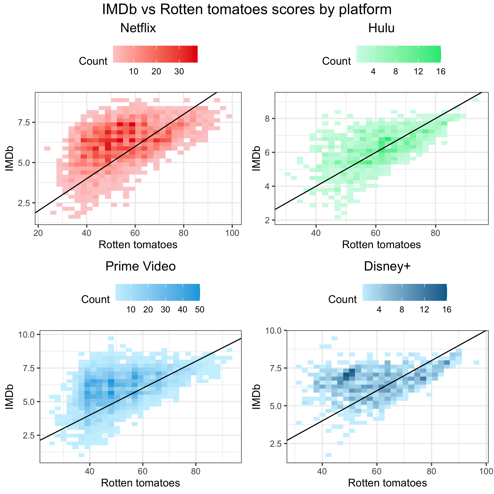
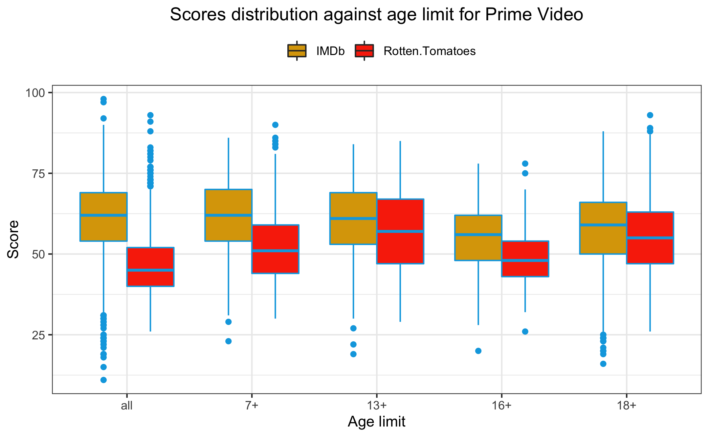
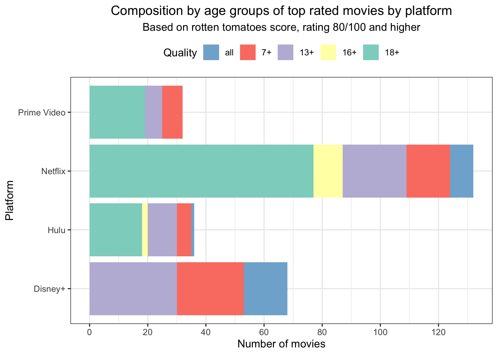

```{r setup, include=FALSE, fig.align='center'}
knitr::opts_chunk$set(echo = TRUE)
```

```{r loading packages, echo=FALSE, warning=FALSE, message=FALSE}
library(shiny)
library(tidyverse)
library(ggmap)
library(janitor)
library(sf)
library(mapview)
library(leaflet)
library(rgdal)
library(RColorBrewer)
library(lubridate)
library(plotly)
library(reshape2)
library(shinyWidgets)
library(ggrepel)
library(dplyr)
library(tidyr)
library(gridExtra)
library(grid)
```

# Introduction and description of database

According to BBC, streaming online platforms became more popular than ever during the lockdown provoked by the COVID-19 pandemic. For instance, in UK during April 2020, 40% of the waking hours were spent in front of the screens, on average. Because of the growing popularity of online streaming services all over the world and the increasing variety of content available on such platforms, in this report we propose to analyze 4 major platforms: Netflix, Prime Video, Hulu and Disney+ in terms of quality. We specifically concentrate on movies that are available on these platforms in the United States. Depending on the platform, the monthly price for subscription varies: in 2021, Netflix costs - 9\$, Prime Video - 9\$, Hulu - 7\$ and Disney+ 8\$. The aim of this report is to understand which platform leads in terms of quality content and suits better potential future users, for example depending on the genre preference or age group. 
The analysis is performed on the dataset available on Kaggle that originally was scraped on the streaming platforms. Specifically, the dataset contains the list of movies available on the 4 streaming pltaforms in 2021. Overall, the dataset contains 9515 row where each row corresponds to a movie and is characterized by the following variables: 

- `ID`, unique ID for each movie,

- `Title`, full title of the movie, 

- `Year`, release year of the movie, time interval from 1914 to 2021,

- `Age`, factor variable specifying age group of the audience for which the movie is intended with the following levels: `all`, `7+`, `13+`, `16+`, `18+`,

- `Rotten Tomatoes`, score out of 100 that intends to measure the quality of movies provided by Rotten Tomatoes - an american review-aggregation website for film and television,

- `IMDb`, score out of 10 that intends to measure the quality of movies provided by IMDb which is an online database of information related to films and television series, including ratings.

- `Netflix`, binary variable taking 1 if the movie is available on Netflix streaming platform, 0 - otherwise,

- `Prime Video`, binary variable taking 1 if the movie is available on Prime Video streaming platform, 0 - otherwise,

- `Hulu`, binary variable taking 1 if the movie is available on Hulu streaming platform, 0 - otherwise,

- `Disney+`, binary variable taking 1 if the movie is available on Disney+ streaming platform, 0 - otherwise.

- `Directors` : production directors;

- `Genres` : film category;

- `Country` : production country;

- `Language` : production language;

- `Runtime` : total duration.

We can see in the pie chart that counts of available movies are not equally distributed between platforms, Netflix and Prime Video have 80% of the total counts.

```{r plot 1 Daryna, echo=FALSE, warning=FALSE, fig.align='center', out.width='60%'}
knitr::include_graphics('plots/plot1.png')
```

```{r plot 1 Thomas, echo=FALSE, warning=FALSE, fig.align='center', out.width='60%'}
knitr::include_graphics('plots_thomas/plot1.png')
```

In the next plot, we can see how movies are spread across time in each platform.
We see that most of available movies on Netflix seems equally distributed between 2006 and 2021 and that Hulu's are less since there is more holder ones.
In the case of Prime Video and Disney+, almost 50% of available movies were produced before 2011, especially for Disney+ for which there is all old movies produced by The Walt Disney Company.

```{r plot 2 Thomas, echo=FALSE, warning=FALSE, fig.align='center', out.width='60%'}
knitr::include_graphics('plots_thomas/plot2.png')
```

As we can see in the next plot, most of the movies available are recent, especially for Netflix ones.
This is consistent with the latter plot.
In particular, here we can see that Prime Video series is the highest one until 2015, which means that it has the higher count of old movies. 

```{r plot 4 Daryna, echo=FALSE, warning=FALSE, fig.align='center', out.width='60%'}
knitr::include_graphics('plots/plot4.png')
```

# Ratings

```{r plot 2 Daryna, echo=FALSE, warning=FALSE, fig.align='center', out.width='60%'}
knitr::include_graphics('plots/plot2.png')
```

The next plot show how ratings are spread for each platform for IMDb and Rotten tomatoes scores. 
For every platform it seems that IMDb boxes are higher than Rotten Tomatoes', which means that IMDb scores are higher than Rotten Tomatoes'.
In particular, boxes are almost at the same level independently of the platform.
This will be investigated further later one.

```{r plot 3 Daryna, echo=FALSE, warning=FALSE, fig.align='center', out.width='60%'}

```

In this plot, we have Rotten Tomatoes scores against IMDb's and a straight line that maps that is the identity if we rescaled each scores on the same scale.
As said before, score higher counts are above this line which means that for a given IMDb score, most of the time Rotten tomatoes' is lower after putting each on the same scale.

```{r plot 6 Thomas, echo=FALSE, warning=FALSE, fig.align='center', out.width='60%'}
knitr::include_graphics('plots_thomas/plot6.png')
```

```{r plot 5 Daryna, echo=FALSE, warning=FALSE, fig.align='center', out.width='60%'}

```

## Ratings by platform

```{r plot 3 Thomas, echo=FALSE, warning=FALSE, fig.align='center', out.width='60%'}

```

```{r plot 4 Thomas, echo=FALSE, warning=FALSE, fig.align='center', out.width='60%'}
knitr::include_graphics('plots_thomas/plot4.png')
```

Here we investigate Rotten tomatoes scores against IMDb's for each platform.
For each platform, except Hulu, we note the same trend as for the basic plot which is that IMDb scores are, in general, higher than Rotten Tomatoes' after rescaling.
For Hulu, it seems that scores are quite the same for both IMDb and Rotten Tomatoes.

Note that this does not imply that for a given movie, IMDb score will be higher or the same as Rotten Tomatoes.
These plots do not take into account movies, just scores independently of the latter.

```{r plot 7 Thomas, echo=FALSE, warning=FALSE, fig.align='center', out.width='60%'}

```

## Ratings by age

In this section we will investigate scores by age group.

In particular, we see that almost 50% of Prime Video and Netflix movies are for all and also that almost 20% are for 18+.
Note that there is a really small proportion of Disney+ movies that are only available for 18+ group.

```{r plot 5 Thomas, echo=FALSE, warning=FALSE, fig.align='center', out.width='60%'}

```

In the next plots, we will discussed by age group and plaform.

For Netflix, IMDb scores seems to be spread similarly in each group, but Rotten Tomatoes' are lower when movies are available for all.
We see that for 13+ and 18+ groups, both scores are distributed similarly.

```{r plot 8 Thomas, echo=FALSE, warning=FALSE, fig.align='center', out.width='60%'}
knitr::include_graphics('plots_thomas/plot8.png')
```

For Hulu, we have that 13+ and 18+ Rotten Tomatoes scores are generally higher than IMDb's, but quite lower for all and 16+ groups.

```{r plot 9 Thomas, echo=FALSE, warning=FALSE, fig.align='center', out.width='60%'}
knitr::include_graphics('plots_thomas/plot9.png')
```

For Prime Video, Rotten Tomatoes scores are lower than IMDb's in general. Scores for all and 16+ groups are for the most part lower than 50.

```{r plot 10 Thomas, echo=FALSE, warning=FALSE, fig.align='center', out.width='60%'}

```

Finally, for Disney+, we see that scores for 18+ group are aggregated around 60. As for some other platforms, IMDb scores are higher generally than Rotten Tomatoes'.
Recall that there is a really small count of such movies on Disney+.

```{r plot 11 Thomas, echo=FALSE, warning=FALSE, fig.align='center', out.width='60%'}
knitr::include_graphics('plots_thomas/plot11.png')
```

To conclude this section, we have seen that movies available to all have, most of the time, higher rates on IMDb than on Rotten Tomatoes.

## Ratings by genre

```{r plot 6 Daryna, echo=FALSE, warning=FALSE, fig.align='center', out.width='60%'}

```

```{r plot 13 Daryna, echo=FALSE, warning=FALSE, fig.align='center', out.width='60%'}

```

```{r plot 7 Daryna, echo=FALSE, warning=FALSE, fig.align='center', out.width='60%'}

```

```{r plot 8 Daryna, echo=FALSE, warning=FALSE, fig.align='center', out.width='60%'}

```

```{r plot 9 Daryna, echo=FALSE, warning=FALSE, fig.align='center', out.width='60%'}

```

```{r plot 10 Daryna, echo=FALSE, warning=FALSE, fig.align='center', out.width='60%'}

```

## Top ratings

```{r plot 14 Daryna, echo=FALSE, warning=FALSE, fig.align='center', out.width='60%'}
knitr::include_graphics('plots/plot14.png')
```

```{r plot 15 Daryna, echo=FALSE, warning=FALSE, fig.align='center', out.width='60%'}
knitr::include_graphics('plots/plot15.png')
```

```{r plot 16 Daryna, echo=FALSE, warning=FALSE, fig.align='center', out.width='60%'}
knitr::include_graphics('plots/plot16.png')
```

```{r plot 17 Daryna, echo=FALSE, warning=FALSE, fig.align='center', out.width='60%'}
knitr::include_graphics('plots/plot17.png')
```

```{r plot 18 Daryna, echo=FALSE, warning=FALSE, fig.align='center', out.width='60%'}

```


# Conclusion

```{r plot 11 Daryna, echo=FALSE, warning=FALSE, fig.align='center', out.width='60%'}
knitr::include_graphics('plots/11.png')
```

```{r plot 12 Daryna, echo=FALSE, warning=FALSE, fig.align='center', out.width='60%'}
knitr::include_graphics('plots/12.png')
```

# Bibliography

- <a href="https://www.kaggle.com">Kaggle</a> :

  - <a href="https://www.kaggle.com/ruchi798/movies-on-netflix-prime-video-hulu-and-disney">Movies on Netflix, Prime Video, Hulu and Disney+</a>
