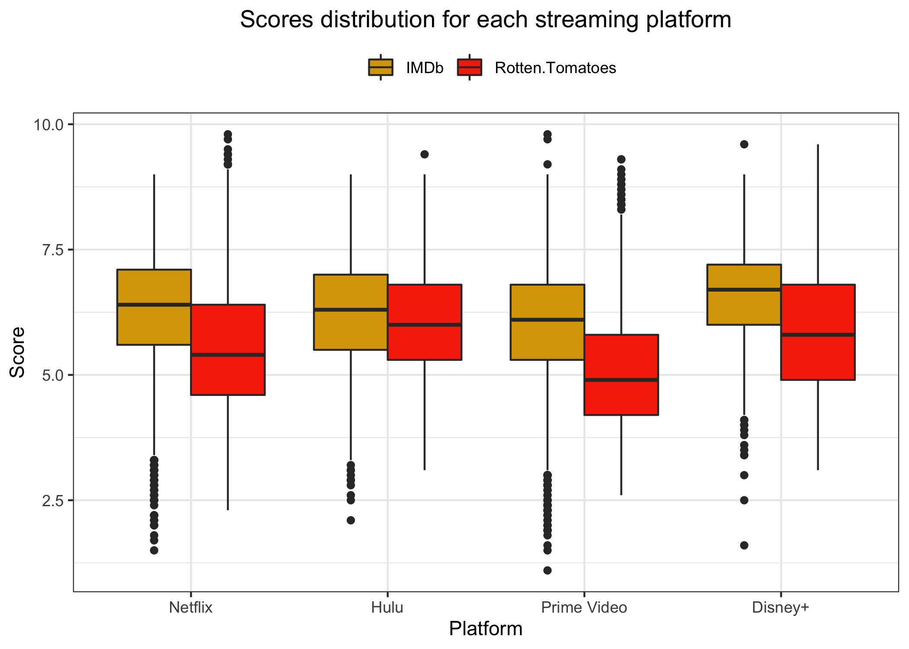

```{r setup, include=FALSE, fig.align='center'}
knitr::opts_chunk$set(echo = TRUE)
```

```{r loading packages, echo=FALSE, warning=FALSE, message=FALSE}
library(shiny)
library(tidyverse)
library(ggmap)
library(janitor)
library(sf)
library(mapview)
library(leaflet)
library(rgdal)
library(RColorBrewer)
library(lubridate)
library(plotly)
library(reshape2)
library(shinyWidgets)
library(ggrepel)
library(dplyr)
library(tidyr)
library(gridExtra)
library(grid)
```

# Introduction and description of database

The main dataset used is composed of the following variables :

- `Title` : the film title;

- `Year` : production year;

- `Age` : age limit for viewing (`all`, `+7`, `+13`, `+16`, `+18`);

- `IMDb` : IMDb rate (between 0 and 10);

- `Rotten.Tomatoes` : Rotten Tomatoes rate (between 0 and 100);

- `Netflix` : 1 if the film is on Netflix and 0 otherwise;

- `Hulu` : 1 if the film is on Hulu and 0 otherwise;

- `Prime.Video` : 1 if the film is on Prime Video and 0 otherwise;

- `Disney.` : 1 if the film is on Disney+ and 0 otherwise;

- `Directors` : production directors;

- `Genres` : film category;

- `Country` : production country;

- `Language` : production language;

- `Runtime` : total duration.


# Thomas

```{r plot 1 Thomas, echo=FALSE, warning=FALSE, fig.align='center', out.width='60%'}

```

```{r plot 2 Thomas, echo=FALSE, warning=FALSE, fig.align='center', out.width='60%'}
knitr::include_graphics('plots_thomas/plot2.png')
```

```{r plot 3 Thomas, echo=FALSE, warning=FALSE, fig.align='center', out.width='60%'}
knitr::include_graphics('plots_thomas/plot3.png')
```

```{r plot 4 Thomas, echo=FALSE, warning=FALSE, fig.align='center', out.width='60%'}

```

```{r plot 5 Thomas, echo=FALSE, warning=FALSE, fig.align='center', out.width='60%'}
knitr::include_graphics('plots_thomas/plot5.png')
```

```{r plot 6 Thomas, echo=FALSE, warning=FALSE, fig.align='center', out.width='60%'}
knitr::include_graphics('plots_thomas/plot6.png')
```

```{r plot 7 Thomas, echo=FALSE, warning=FALSE, fig.align='center', out.width='60%'}
knitr::include_graphics('plots_thomas/plot7.png')
```

```{r plot 8 Thomas, echo=FALSE, warning=FALSE, fig.align='center', out.width='60%'}

```

```{r plot 9 Thomas, echo=FALSE, warning=FALSE, fig.align='center', out.width='60%'}
knitr::include_graphics('plots_thomas/plot9.png')
```

```{r plot 10 Thomas, echo=FALSE, warning=FALSE, fig.align='center', out.width='60%'}
knitr::include_graphics('plots_thomas/plot10.png')
```

```{r plot 11 Thomas, echo=FALSE, warning=FALSE, fig.align='center', out.width='60%'}
knitr::include_graphics('plots_thomas/plot11.png')
```


# Daryna

```{r plot 1 Daryna, echo=FALSE, warning=FALSE, fig.align='center', out.width='60%'}
knitr::include_graphics('plots/1.png')
```

```{r plot 2 Daryna, echo=FALSE, warning=FALSE, fig.align='center', out.width='60%'}
knitr::include_graphics('plots/2.png')
```

```{r plot 3 Daryna, echo=FALSE, warning=FALSE, fig.align='center', out.width='60%'}
knitr::include_graphics('plots/3.png')
```

```{r plot 4 Daryna, echo=FALSE, warning=FALSE, fig.align='center', out.width='60%'}
knitr::include_graphics('plots/4.png')
```

```{r plot 5 Daryna, echo=FALSE, warning=FALSE, fig.align='center', out.width='60%'}
knitr::include_graphics('plots/5.png')
```

```{r plot 6 Daryna, echo=FALSE, warning=FALSE, fig.align='center', out.width='60%'}
knitr::include_graphics('plots/6.png')
```

```{r plot 7 Daryna, echo=FALSE, warning=FALSE, fig.align='center', out.width='60%'}
knitr::include_graphics('plots/7.png')
```

```{r plot 8 Daryna, echo=FALSE, warning=FALSE, fig.align='center', out.width='60%'}
knitr::include_graphics('plots/8.png')
```

```{r plot 9 Daryna, echo=FALSE, warning=FALSE, fig.align='center', out.width='60%'}
knitr::include_graphics('plots/9.png')
```

```{r plot 10 Daryna, echo=FALSE, warning=FALSE, fig.align='center', out.width='60%'}
knitr::include_graphics('plots/10.png')
```

```{r plot 11 Daryna, echo=FALSE, warning=FALSE, fig.align='center', out.width='60%'}

```

```{r plot 12 Daryna, echo=FALSE, warning=FALSE, fig.align='center', out.width='60%'}
knitr::include_graphics('plots/12.png')
```

```{r plot 13 Daryna, echo=FALSE, warning=FALSE, fig.align='center', out.width='60%'}
knitr::include_graphics('plots/13.png')
```

```{r plot 14 Daryna, echo=FALSE, warning=FALSE, fig.align='center', out.width='60%'}
knitr::include_graphics('plots/14.png')
```

```{r plot 15 Daryna, echo=FALSE, warning=FALSE, fig.align='center', out.width='60%'}
knitr::include_graphics('plots/15.png')
```

```{r plot 16 Daryna, echo=FALSE, warning=FALSE, fig.align='center', out.width='60%'}
knitr::include_graphics('plots/16.png')
```

```{r plot 17 Daryna, echo=FALSE, warning=FALSE, fig.align='center', out.width='60%'}
knitr::include_graphics('plots/17.png')
```

```{r plot 18 Daryna, echo=FALSE, warning=FALSE, fig.align='center', out.width='60%'}
knitr::include_graphics('plots/18.png')
```

# Conclusion

# Bibliography

- <a href="https://www.kaggle.com">Kaggle</a> :

  - <a href="https://www.kaggle.com/ruchi798/movies-on-netflix-prime-video-hulu-and-disney">Movies on Netflix, Prime Video, Hulu and Disney+</a>
