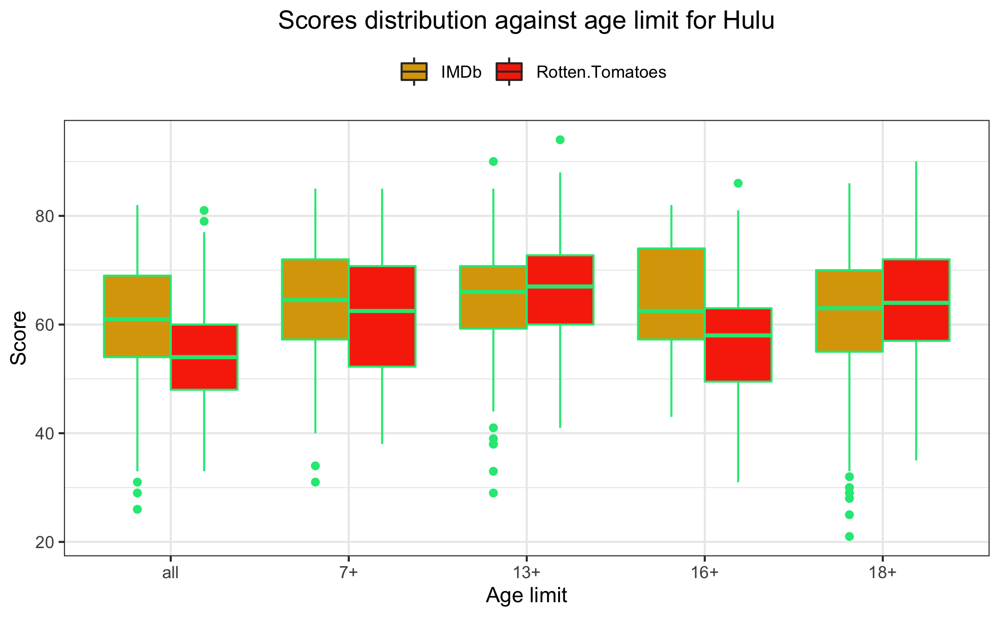
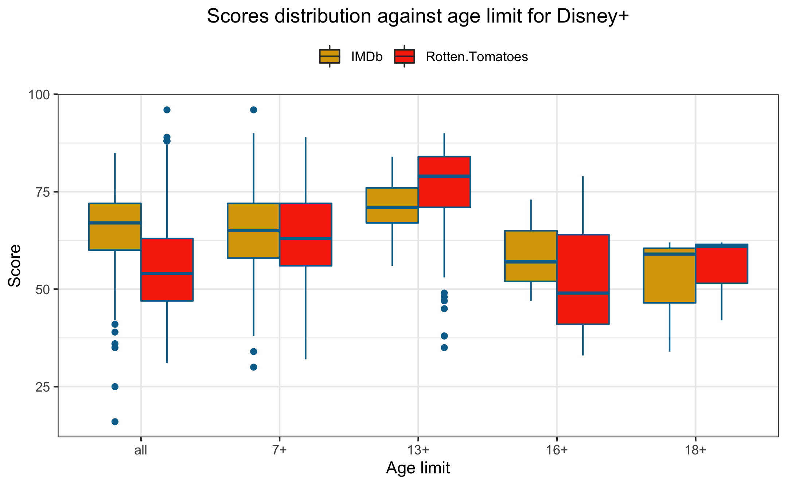
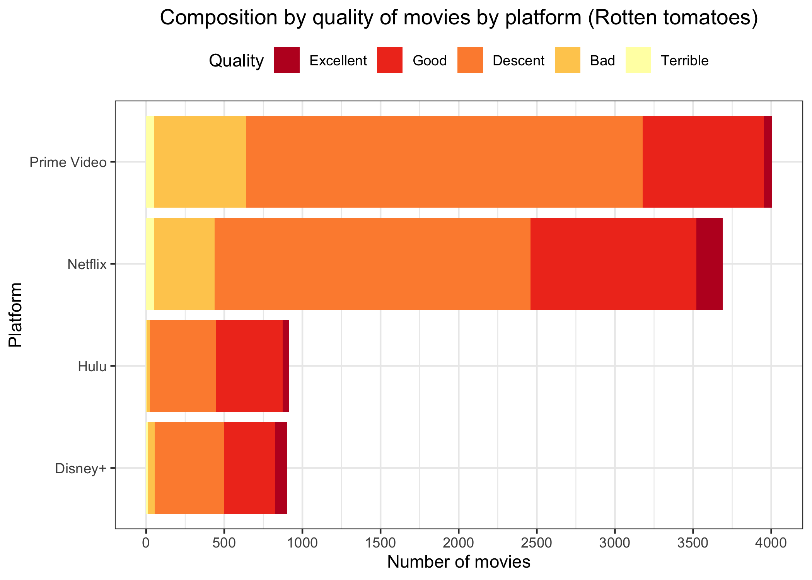
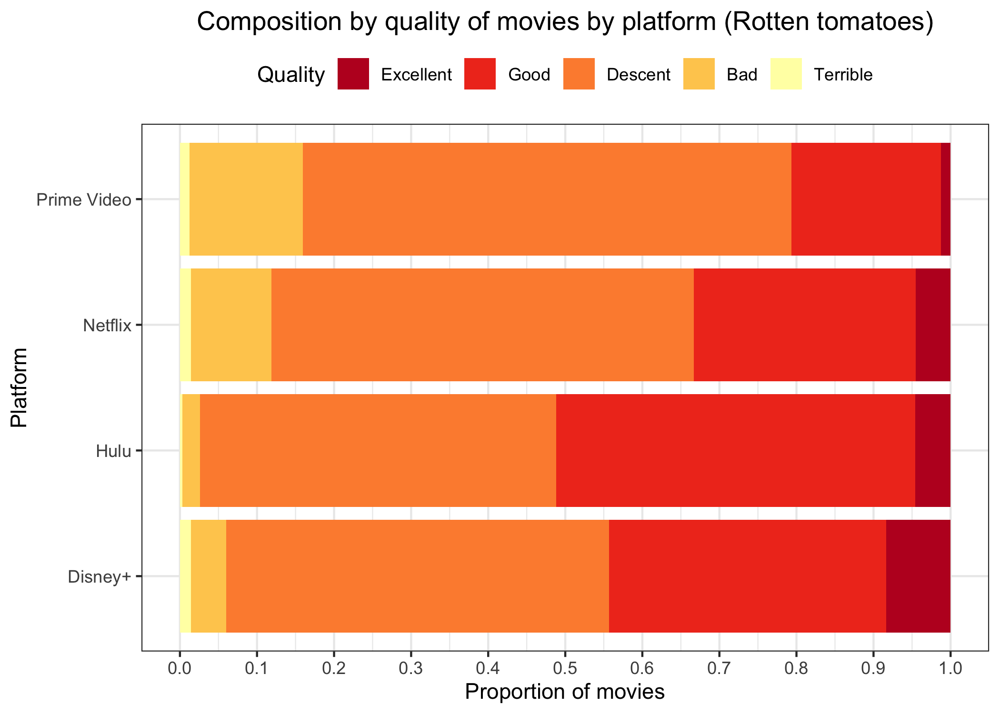

```{r setup, include=FALSE, fig.align='center'}
knitr::opts_chunk$set(echo = TRUE)
```

```{r loading packages, echo=FALSE, warning=FALSE, message=FALSE}
library(shiny)
library(tidyverse)
library(ggmap)
library(janitor)
library(sf)
library(mapview)
library(leaflet)
library(rgdal)
library(RColorBrewer)
library(lubridate)
library(plotly)
library(reshape2)
library(shinyWidgets)
library(ggrepel)
library(dplyr)
library(tidyr)
library(gridExtra)
library(grid)
```

# Introduction and description of database

According to BBC, streaming online platforms became more popular than ever during the lockdown provoked by the COVID-19 pandemic. For instance, in UK during April 2020, 40% of the waking hours were spent in front of the screens, on average. Because of the growing popularity of online streaming services all over the world and the increasing variety of content available on such platforms, in this report we propose to analyze 4 major platforms: Netflix, Prime Video, Hulu and Disney+ in terms of quality. We specifically concentrate on movies that are available on these platforms in the United States. Depending on the platform, the monthly price for subscription varies: in 2021, Netflix costs - 9\$, Prime Video - 9\$, Hulu - 7\$ and Disney+ 8\$. The aim of this report is to understand which platform leads in terms of quality content and suits better potential future users, for example depending on the genre preference or age group. 
The analysis is performed on the dataset available on Kaggle that originally was scraped on the streaming platforms. Specifically, the dataset contains the list of movies available on the 4 streaming platforms in 2021. Overall, the dataset contains 9515 rows where each row corresponds to a movie and is characterized by the following variables: 

- `ID`, unique ID for each movie,

- `Title`, full title of the movie, 

- `Year`, release year of the movie, time interval from 1914 to 2021,

- `Age`, factor variable specifying age group of the audience for which the movie is intended with the following levels: `all`, `7+`, `13+`, `16+`, `18+`,

- `Rotten Tomatoes`, score out of 100 that intends to measure the quality of movies provided by Rotten Tomatoes - an American review-aggregation website for film and television,

- `IMDb`, score out of 10 that intends to measure the quality of movies provided by IMDb which is an online database of information related to films and television series, including ratings.

- `Netflix`, binary variable taking 1 if the movie is available on Netflix streaming platform, 0 - otherwise,

- `Prime Video`, binary variable taking 1 if the movie is available on Prime Video streaming platform, 0 - otherwise,

- `Hulu`, binary variable taking 1 if the movie is available on Hulu streaming platform, 0 - otherwise,

- `Disney+`, binary variable taking 1 if the movie is available on Disney+ streaming platform, 0 - otherwise,

- `Directors` : production directors of the movie,

- `Genres` : production genre categories of the movie,

- `Country` : production countries of the movie,

- `Language` : production languages of the movie,

- `Runtime` : total duration of the movie.

Let's first investigate how the total number of available movies is distributed through the 4 platforms. Prime Video contains the largest movie collection with 4'113 movies. Netflix, second in terms of counts of movies, has a slightly smaller number: 3695, overall Netflix and Prime Video have 80% of the total counts. Hulu and Disney+, are more than 3 times smaller than the 2 "movie giants", with 1047 and 922 movies, respectively.

```{r plot 1 Daryna, echo=FALSE, warning=FALSE, fig.align='center', out.width='60%'}

```

In the next plot, we can see how movies are spread across time in each platform.
We see that most of available movies on Netflix seems equally distributed between 2006 and 2021.
In the case of Prime Video and Disney+, almost 50% of available movies were produced before 2011, especially for Disney+ for which there is all old movies produced by The Walt Disney Company.

```{r plot 2 Thomas, echo=FALSE, warning=FALSE, fig.align='center', out.width='60%'}

```

This time series plot represents the frequency of movies depending on the platform and the year of the release of the movie.

As we can see, most of the movies available are recent, especially for Netflix ones.
Netflix doesn't contain movies released before 1955, however has the highest number of movies released after 2015, almost twice as much as Prime Video, 4 times as Hulu and 10 times as Disney+.
This is consistent with the latter plot.

We notice, that Prime Video has the the highest number of movies released in the 20th century than the rest of the platforms.

```{r plot 4 Daryna, echo=FALSE, warning=FALSE, fig.align='center', out.width='60%'}

```

# Ratings

On this plot we visualize the  distribution of the 2 popular scores that intend to rate the quality of movies. 
On the left we represent the distribution of scores generated by Rotten Tomatoes rating.
The score is a grade out of 100 points, with 100 being excellent and 0 being terrible.
The distribution seems symmetric with a mean close to 55 points. 
We notice a similar behavior on the right, where the histogram represents the distribution of the IMDb score, which takes a value between 0 and 10, with 10 being excellent and 0 being terrible.
The distribution seems symmetric with a mean close to 60 points. 

```{r plot 2 Daryna, echo=FALSE, warning=FALSE, fig.align='center', out.width='60%'}

```

This plot represents the distribution of the 2 rating scores on the scale of 100 for the 4 platforms, we use the original score for Rotten Tomatoes and a rescaled score (multiplied by 10) for IMDb. We notice that boxes representing the distribution of Rotten Tomatoes, for each platform, are slightly lower than in the case of IMDb. Also every platform has much more negative outliers than positive ones.
In particular, boxes are almost at the same level independently of the platform.
This will be investigated further later one.

```{r plot 3 Daryna, echo=FALSE, warning=FALSE, fig.align='center', out.width='60%'}
knitr::include_graphics('plots/plot3.png')
```

In this plot, we have Rotten Tomatoes scores against IMDb's and a straight line that is the identity if we rescaled each scores on the same scale.
As said before, score higher counts are above this line which means that for a given IMDb score, most of the time Rotten tomatoes' is lower after putting each on the same scale.

```{r plot 6 Thomas, echo=FALSE, warning=FALSE, fig.align='center', out.width='60%'}
knitr::include_graphics('plots_thomas/plot6.png')
```

The plots represent the ratings for each movie depending on the release year: on the left - rating of Rotten Tomatoes and on the right - rating of IMDb.
In both cases, the mean didn't change too much over time - slightly increased for Rotten Tomatoes and slightly decreased for IMDb, however as the number of available released movies on platforms increased - the variance seems increasing with time.
Notice that density and variance of points is higher for 21st century due to the higher number of movies available.

```{r plot 5 Daryna, echo=FALSE, warning=FALSE, fig.align='center', out.width='60%'}
knitr::include_graphics('plots/plot5.png')
```

## Ratings by platform

Here we investigate Rotten tomatoes scores against IMDb's for each platform.
For each platform, except Hulu, we note the same trend as for the basic plot which is that IMDb scores are, in general, higher than Rotten Tomatoes' after rescaling.
For Hulu, it seems that scores are quite the same for both IMDb and Rotten Tomatoes.

Note that this does not imply that for a given movie, IMDb score will be higher or the same as Rotten Tomatoes.
These plots do not take into account the counts of movies, just scores independently of the latter.

```{r plot 7 Thomas, echo=FALSE, warning=FALSE, fig.align='center', out.width='60%'}
knitr::include_graphics('plots_thomas/plot7.png')
```

## Ratings by age

In this section we will investigate scores by age group.

In particular, we see that almost 50% of Prime Video and Netflix movies are for all audience and also that almost 20% are for 18+.
Note that there is a really small proportion of Disney+ movies that are only available for 18+ group.

```{r plot 5 Thomas, echo=FALSE, warning=FALSE, fig.align='center', out.width='60%'}
knitr::include_graphics('plots_thomas/plot5.png')
```

In the next plots, we will discuss by age group and platform.

For Netflix, IMDb scores seems to be spread similarly in each group, but Rotten Tomatoes' are lower when movies are available for all.
We see that for 13+ and 18+ groups, both scores are distributed similarly.

```{r plot 8 Thomas, echo=FALSE, warning=FALSE, fig.align='center', out.width='60%'}
knitr::include_graphics('plots_thomas/plot8.png')
```

For Hulu, we have that 13+ and 18+ Rotten Tomatoes scores are generally higher than IMDb's, but quite lower for `all` and 16+ groups.

```{r plot 9 Thomas, echo=FALSE, warning=FALSE, fig.align='center', out.width='60%'}

```

For Prime Video, Rotten Tomatoes scores are lower than IMDb's in general. Scores for `all` and 16+ groups are for the most part lower than 50.

```{r plot 10 Thomas, echo=FALSE, warning=FALSE, fig.align='center', out.width='60%'}
knitr::include_graphics('plots_thomas/plot10.png')
```

Finally, for Disney+, we see that scores for 18+ group are aggregated around 60. As for some other platforms, IMDb scores are higher generally than Rotten Tomatoes'.
Recall that there is a really small count of such movies on Disney+.

```{r plot 11 Thomas, echo=FALSE, warning=FALSE, fig.align='center', out.width='60%'}

```

To conclude this section, we have seen that movies available to all have, most of the time, higher rates on IMDb than on Rotten Tomatoes.

## Ratings by genre

The plot below represents how the popular movie genres are distributed across the platforms. We notice that for most of the genres, Netflix and Amazon dominate with the highest counts, in some cases Netflix wins (for example, in comedy) in other cases Amazon wins (for example, in drama). The only category which is an exception is animation, where Disney+ holds the biggest collection of movies.

```{r plot 6 Daryna, echo=FALSE, warning=FALSE, fig.align='center', out.width='60%'}
knitr::include_graphics('plots/plot6.png')
```

As seen before, in 20th century there is more content on Disney+ and Prime Video, but scores are not highly rated.
For recent years, Netflix and Hulu tend to have highly rated movies in comparison with the other two.

```{r plot 13 Daryna, echo=FALSE, warning=FALSE, fig.align='center', out.width='60%'}
knitr::include_graphics('plots/plot13.png')
```

## Top ratings

The time series represents the average rating provided by Rotten Tomatoes by streaming platform over the released years.
We notice that, on average, Hulu and Disney+ have higher ratings than the two big platforms after 1960.
Amazon Prime and Netflix seem to have similar ratings before 1990, however after that, Prime Video is lower than Netflix on average. 

```{r plot 14 Daryna, echo=FALSE, warning=FALSE, fig.align='center', out.width='60%'}

```

The plot represents the composition of quality categories by streaming platforms according to Rotten Tomatoes rating.
The categories were defined the following way: grade 'Excellent' corresponds to a score between 80 and 100, 'Good'- between 60 and 79, 'Descent' - between 40 and 59, 'Bad' between 20 and 39 and 'Terrible' - between 0 and 19.

We see that Netflix has the highest number of movies that are graded as 'Good' and 'Excellent' than any other platform.
Prime Video is the second with the count of 'Good' movies but has also the biggest number of movies considered as 'Bad' and 'Terrible'.

```{r plot 15 Daryna, echo=FALSE, warning=FALSE, fig.align='center', out.width='60%'}

```

By looking on the same plot representing the proportion of quality categories within each platform, we notice that Hulu and Disney+ have a much smaller share of bad rated movies than Prime Video and Netflix and a higher of good rated movies. 

```{r plot 16 Daryna, echo=FALSE, warning=FALSE, fig.align='center', out.width='60%'}

```

On this plot we can closely study the composition of the top rated movies by platform.
Disney+ seems to lead in the count of highly rated movies for categories 'Action' and 'Animation'.
Netflix wins in numbers in categories 'Comedy', 'Crime', 'Documentary' and 'Drama'.

```{r plot 17 Daryna, echo=FALSE, warning=FALSE, fig.align='center', out.width='60%'}

```

This plot represents the composition of movies available for specific age groups.
We notice that Netflix seems to have the biggest share of content for adult audience (18+) and Disney+ for young audience (7+ and 13+).
In proportion, Prime Video and Hulu also tend to have an adult oriented content.

```{r plot 18 Daryna, echo=FALSE, warning=FALSE, fig.align='center', out.width='60%'}
knitr::include_graphics('plots/plot18.png')
```


# Conclusion

To conclude, quality doesn't equal quantity. Particularly, Prime Video, having the highest number of available movies is not the one holding the best rated movies.
However, Prime Video has an advantage of a large collection of movies from the 20th century, which other platforms lack.

Netflix, being the one with the highest quality content, also benefits from a variety of genres (mostly oriented to adults). The second position in terms of quality movies holds Disney+ which is mostly oriented towards young audience. Hulu, being the cheapest platform, has the lowest number of content, however the distribution of quality seems fair.

We learn that depending on multiple criteria, the choice between the 4 streaming platforms may differ depending on the audience and its need. 
Also, these platforms concern different types of movies (genre and age categories), this implies that one platform is better if we are more interested in a certain type of movie and another in a different case.

As in this analysis we only analyzed movies, for future work we may consider a bigger dataset containing information about TV shows and other types of content.

We propose you some of the highest rated movies on these platforms in the following two plots by genre and on which platform it can be found.

The plot represents the movies that had a rate higher than 90 in Rotten Tomatoes rating. The majority seems to be movies released after 2015 and considered as genre drama.

```{r plot 11 Daryna, echo=FALSE, warning=FALSE, fig.align='center', out.width='60%'}
knitr::include_graphics('plots/11.png')
```

The movies with the highest rating can be mostly found on Netflix. 

```{r plot 12 Daryna, echo=FALSE, warning=FALSE, fig.align='center', out.width='60%'}

```

# Bibliography

- <a href="https://www.kaggle.com">Kaggle</a> :

  - <a href="https://www.kaggle.com/ruchi798/movies-on-netflix-prime-video-hulu-and-disney">Movies on Netflix, Prime Video, Hulu and Disney+</a>
  
- <a href="https://www.bbc.com/news/entertainment-arts-53637305">BBC : TV watching and online streaming surge during lockdown</a> : 

- <a href="https://www.cnet.com/tech/services-and-software/best-streaming-service-of-2022/">CNET : Best streaming service of 2022: Netflix, Disney Plus, HBO Max, Prime Video, Hulu, ESPN Plus and more</a>


